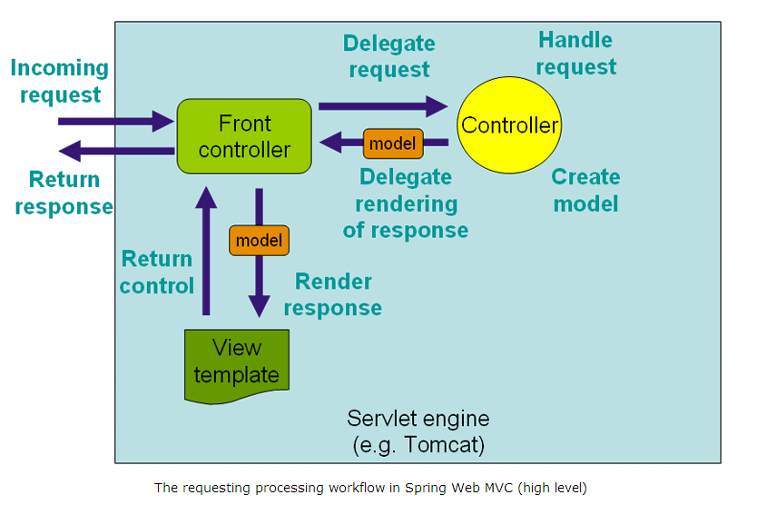
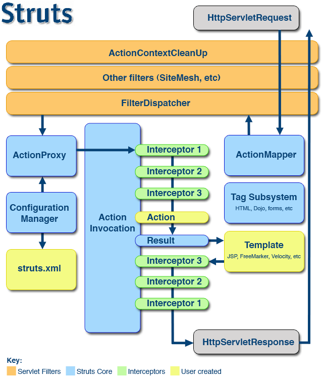

<!-- TOC -->

- [Java](#java)
    - [MVC](#mvc)
        - [Spring MVC](#spring-mvc)
        - [Structs2](#structs2)
- [资源](#资源)

<!-- /TOC -->
# Java

## MVC

### Spring MVC

**SpringMVC** 是 **Spring** 中的模块，它实现了 **MVC** 设计模式的 web 框架， 首先用户发出请求，请求到达 **SpringMVC** 的前端控制器（`DispatcherServlet`）, 前端控制器根据用户的 URL 请求处理器映射器查找匹配该 URL 的 handler， 并返回一个执行链，前端控制器再请求处理器适配器调用相应的 handler 进行处理并返回给前端控制器一个 modelAndView， 前端控制器再请求视图解析器对返回的逻辑视图进行解析， 最后前端控制器将返回的视图进行渲染并把数据装入到 response 域，返回给用户。 `DispatcherServlet` 作为 **SpringMVC** 的前端控制器，负责接收用户的请求并根据用户的请求返回相应的视图给用户。

### Structs2

此处的 `FilterDispatcher` 应为 `StrutsPrepareAndExecuteFilter`

# 资源

[开源巨献：Google最热门60款开源项目](https://mp.weixin.qq.com/s/qo-Rot26y92J5whLnvlMaw) 
