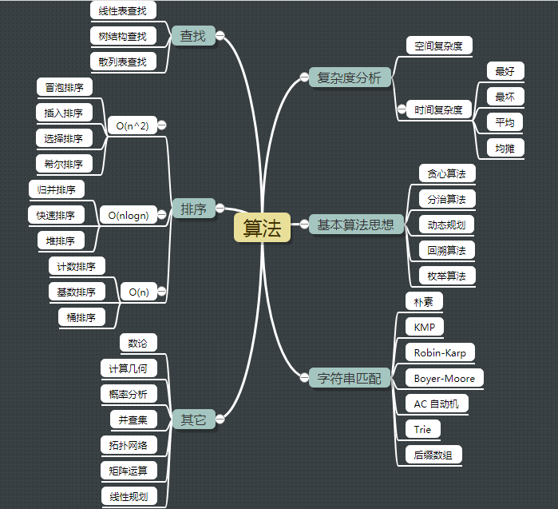

<!-- TOC -->

- [算法](#算法)
    - [复杂度分析](#复杂度分析)
        - [大 O 复杂度表示法](#大-o-复杂度表示法)
- [基本思想](#基本思想)
    - [递归](#递归)
- [排序](#排序)
- [资源](#资源)

<!-- /TOC -->

# 算法

算法就是操作数据的一组方法, 作用在特定的数据结构之上.



## 复杂度分析

复杂度分析是整个算法学习的精髓, 只要掌握了它, 数据结构和算法的内容基本上就掌握了一半.

### 大 O 复杂度表示法

大 O 时间复杂度实际上并不具体表示代码真正的执行时间, 而是表示**代码执行时间随数据规模增长的变化趋势**, 所以, 也叫作**渐进时间复杂度**(asymptotic time complexity), 简称**时间复杂度**.

**多项式量级**

- 常量阶 O(1)

一般情况下, 只要算法不存在循环语句、递归语句, 即使有成千上万行的代码, 其时间复杂度也是 O(1).

```java
int i = 1;
int j = 2;
int sum = i + j;
```

- 对数阶 O(logn)

```java
int i = 1;
while (i <= n) {
    i = i * 2;
}
```

- 线性阶 O(n)

```java
int i = 0;
while (i < n) {
    i++;
}
```

- 线性对数阶 O(nlogn)
- 平方阶 O(n^2)、立方阶 O(n^3)、k 次方阶 O(n^k)

**非多项式量阶**

- 指数阶 O(2^n)
- 阶乘阶 O(n!)

# 基本思想

## 递归

**递归需要满足的三个条件**

1. 一个问题的解可以分解为几个子问题的解.
2. 这个问题与分解之后的子问题, 除了数据规模不同, 求解思路完全一样.
3. 存在递归终止条件.

*递归代码要警惕栈溢出*, *递归代码要警惕重复计算*

# 排序

排序算法|时间复杂度|是否基于比较
:---:|:---:|:---:
冒泡、插入、选择|O(n^2)|✔
快排、归并|O(nlogn)|✔
桶、计数、基数|O(n)|×

# 资源

<算法图解><br>