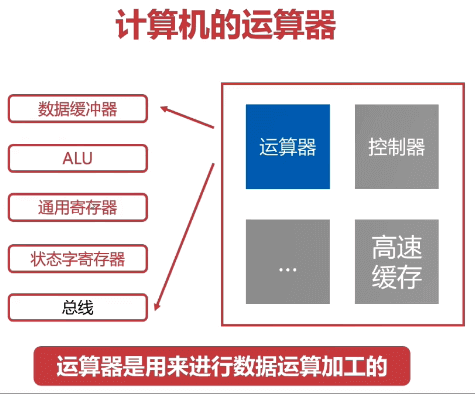
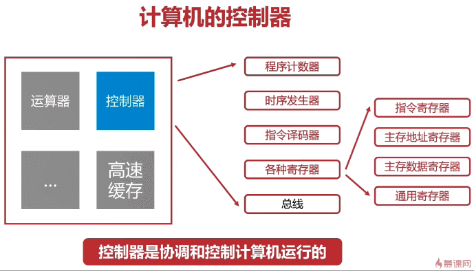

<!-- TOC -->

- [中央处理器](#中央处理器)
    - [运算器](#运算器)
        - [数据缓冲器](#数据缓冲器)
        - [ALU](#alu)
        - [状态字寄存器](#状态字寄存器)
        - [通用寄存器](#通用寄存器)
    - [控制器](#控制器)
        - [程序计数器](#程序计数器)
        - [时序发生器](#时序发生器)
        - [指令译码器](#指令译码器)
        - [指令寄存器](#指令寄存器)
        - [主存数据寄存器](#主存数据寄存器)
        - [通用寄存器](#通用寄存器-1)
- [指令系统](#指令系统)
    - [组成](#组成)
    - [操作类型](#操作类型)
    - [寻址方式](#寻址方式)
- [执行过程](#执行过程)
    - [指令执行过程](#指令执行过程)
    - [CPU 的流水线设计](#cpu-的流水线设计)

<!-- /TOC -->

# 中央处理器

硬件系统的核心是中央处理器（Central Processing Unit，简称 CPU）。它主要由控制器、运算器等组成，并采用大规模集成电路工艺制成的芯片，又称微处理器芯片。程序是由指令构成的, 处理器是执行指令的硬件设备, 一个系统中可能有多个处理器.

## 运算器



运算器又称算术逻辑单元（Arithmetic Logic Unit 简称 ALU）。它是计算机对数据进行加工处理的部件，包括算术运算（加、减、乘、除等）和逻辑运算（与、或、非、异或、比较等）。

### 数据缓冲器

- 分为输入缓冲和输出缓冲
- 输入缓冲暂时存放外设送过来的数据
- 输出缓冲暂时存放送往外设的数据

### ALU

- ALU: 算术逻辑单元, 是运算器的主要组成
- 常见的位运算(左右移、与或非等)
- 算术运算(加减乘除等)

### 状态字寄存器

- 存放运算状态(条件码、进位、溢出、结果正负等)
- 存放运算控制信息(调试跟踪标记位、允许中断位等)

### 通用寄存器

- 用于暂时存放或传送数据或指令
- 可保存 ALU 的运算中间结果
- 容量比一般专用寄存器更大

## 控制器



控制器负责从存储器中取出指令，并对指令进行译码；根据指令的要求，按时间的先后顺序，负责向其它各部件发出控制信号，保证各部件协调一致地工作，一步一步地完成各种操作。控制器主要由指令寄存器、译码器、程序计数器、操作控制器等组成。

### 程序计数器

- 程序计数器用来存储下一条指令的地址
- 循环从程序计数器中拿出指令
- 当指令被拿出时, 指向下一条指令

### 时序发生器

- 电气工程领域, 用于发送时序脉冲
- CPU 依据不同的时序脉冲有节奏的进行工作

### 指令译码器

- 指令译码器是控制器的主要部件之一
- 计算机指令由操作码和地址码组成
- 翻译操作码对应的操作以及控制传输地址码对应的数据

### 指令寄存器

- 指令寄存器也是控制器的主要部件之一
- 从主存或高速缓存存取计算机指令

### 主存数据寄存器

- 保存当前 CPU 正要读或写的主存数据

### 通用寄存器

- 用于暂时存放或传送数据或指令
- 可保存 ALU 的运算中间结果
- 容量比一般专用寄存器要大

# 指令系统

## 组成

1. 机器指令主要由两部分组成: 操作码 + 地址码
2. 操作码指明指令所要完成的操作
    - 操作码的位数反映了机器的操作种类
    - 如: 操作码字段有 8 位, 则表明它最多有 256 种操作
3. 地址码直接给出操作数或操作数的地址
    - 分三地址指令、二地址指令和一地址指令
    - 三地址指令: 操作码(OP) addr1 addr2 addr3, 如: k = i + j
    - 二地址指令: 操作码(OP) addr1 addr2, 如: i || j
    - 一地址指令: 操作码(OP) addr1, 如: ++i
    - 零地址指令: 在机器指令中无地址码, 如: 空操作、停机操作、中断返回操作等

## 操作类型

1. 数据传输
    - 寄存器之间、寄存器与存储单元、存储单元之间传送
    - 数据读写、交换地址数据、清零置一等操作
2. 算术逻辑操作
    - 操作数之间的加减乘除运算
    - 操作数的与或非等逻辑位运算
3. 移位操作
    - 数据左移(乘 2)、数据右移(除 2)
    - 完成数据在算术逻辑单元的必要操作
4. 控制指令
    - 等待指令、停机指令、空操作、中断指令等

## 寻址方式

1. 指令寻址
    - 顺序寻址
    - 跳跃寻址

地址|指令|说明
:---|:---:|:---
101|MOV R0,R1|顺序
102|LAD R1,6|顺序
103|ADD R1,R2|顺序
104|ADD R1,R3|顺序
105|JMP 102|跳跃

2. 数据寻址
    - 立即寻址
        - 操作码(OP) addr1 6
        - 指令直接获得操作数 6
        - 无需访问存储器
    - 直接寻址
        - 操作码(OP) addr1 6
        - 直接给出操作数在主存的地址 addr1
        - 寻找操作数简单, 无需计算数据地址
    - 间接寻址
        - 操作码(OP) R1 addr2
        - 指令地址码给出的是操作数地址的地址
        - 需要反问一次或多次主存来获取操作数

# 执行过程

## 指令执行过程

```
取指令 -> 分析指令 -> 执行指令
```

## CPU 的流水线设计

- 类似工厂的装配线
- 工厂的装配线使得多个产品可以同时被加工
- 在同一个时刻, 不同产品均位于不同的加工阶段
