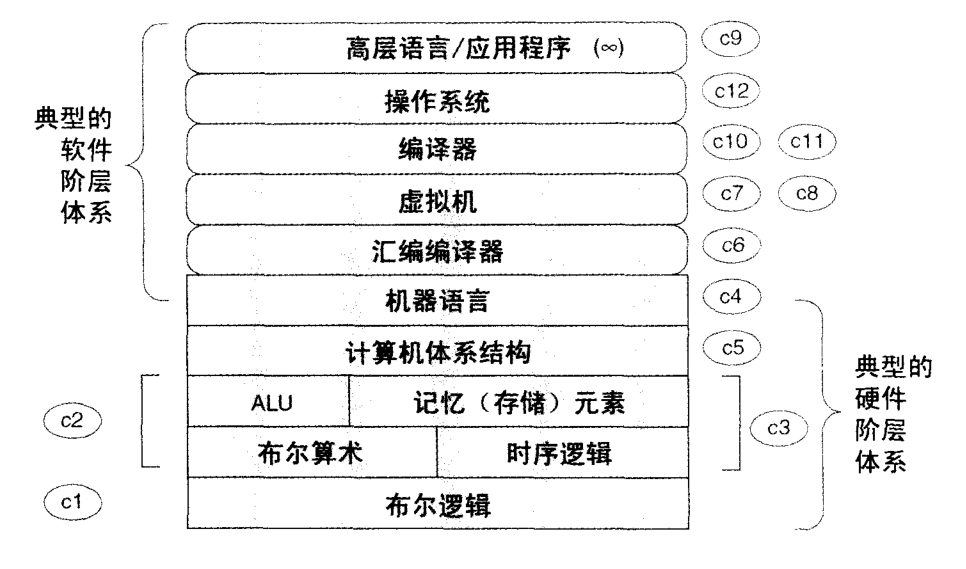
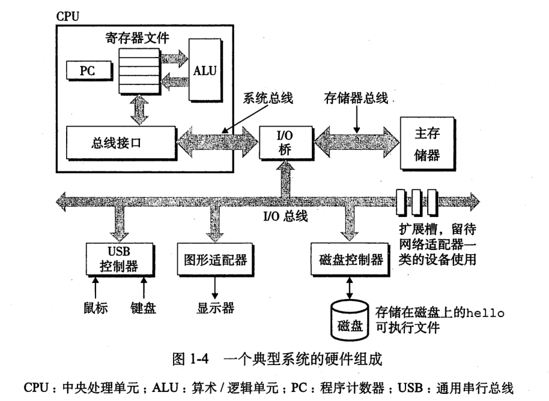

<!-- TOC -->

- [硬件](#硬件)
- [资源](#资源)

<!-- /TOC -->

# 硬件

逻辑门;  
布尔运算;  
multiplexor (多路复用器);  
触发器 (flip-flop);  
寄存器 (register);  
RAM 单元; 计数器;  
硬件描述语言 (HDL, Hardware Description Language);  
芯片的仿真及测试. 

计算机最关键的三个部分：CPU,内存,I/O控制芯片。

# 资源

[GeeksforGeeks Operating System](https://www.geeksforgeeks.org/operating-systems/) 
[simple-computer](https://github.com/djhworld/simple-computer) 
[程序员的自我修养：温故而知新](https://mp.weixin.qq.com/s/8rQKJxFaFDznrTRHmVNNQA) 
[来点硬核的：什么是RDMA？](https://mp.weixin.qq.com/s/b6NaCu0_M-__XHWpKODx6w) 
[【底层原理】基本内存管理（上）](https://mp.weixin.qq.com/s/MGEMmrCxTfi8K8spebsC_w) 
[【底层原理】网络数据传输时经历了哪些buffer](https://mp.weixin.qq.com/s/ZaQ6rpT_jOyaEtW7YPNXZw) 
[【系统编程】高性能网络I/O入门（一）](https://mp.weixin.qq.com/s/IUlwCPvf8okbHsbfd1q2rA) 
[【系统编程】五种IO模型分析](https://mp.weixin.qq.com/s/9YXsJo_u2zVNqvABoGqfqg) 
[计算机是如何诞生的？](https://mp.weixin.qq.com/s/pijV1BmYPOKdlk4B3nGnHQ) 
