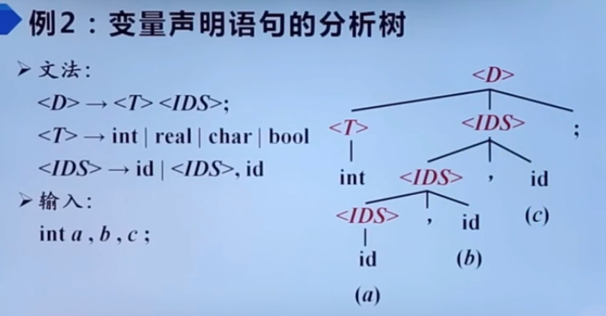

<!-- TOC -->

- [编译原理](#编译原理)
    - [计算机程序设计及编译](#计算机程序设计及编译)
    - [编译器在语言处理系统的位置](#编译器在语言处理系统的位置)
- [编译系统的结构](#编译系统的结构)
    - [词法分析/扫描(Scanning)](#词法分析扫描scanning)
    - [语法分析](#语法分析)
    - [语义分析](#语义分析)
    - [中间代码生成](#中间代码生成)
    - [目标代码生成](#目标代码生成)
    - [代码优化](#代码优化)
- [编译器](#编译器)

<!-- /TOC -->

# 编译原理

## 计算机程序设计及编译

**机器语言**

```
C706 0000 0002
```

可以被计算机直接理解。

缺点：1. 与人类表达习惯相去甚远；2. 难记忆；3. 难编写，难阅读。

**汇编语言**

```
MOV X, 2
```

引入助记符。将汇编语言翻译成机器语言的过程叫做汇编。

缺点：1. 依赖特定机器，非计算机专业人员使用受限制；2. 编写效率依然很低

**高级语言**

```
x = 2
```

类似于数学定义或自然语言的简洁形式。*将高级语言编译成汇编语言或者机器语言的过程叫做编译。*

优点：1. 接近人类表达习惯；2. 不依赖于特定机器；3. 编写效率高

## 编译器在语言处理系统的位置

```
          源程序
            ↓
  [预处理器(Preprocessor)]
            ↓
     经过预处理的源程序
            ↓
         [编译器]
            ↓
       汇编语言程序
            ↓
     [汇编器(Assembler)]
            ↓
     可重定位的机器代码
            ↓
[链接器(Linker)/加载器(Loader)]
            ↓
        目标机器代码
```

**预处理器**

1. 把存储在不同文件中的源程序*聚合*在一起
2. 把被称为*宏*的缩写语句转换为原始语句

**汇编器**

可重定位(Relocatable): 在内存中存放的起始位置 L 不是固定的。

起始位置 + 相对位置 = 绝对位置

**链接器**

1. 将多个可重定位的机器代码文件（包括库文件）连接到一起
2. 解决外部内存地址问题

**加载器**

修改可重定位地址：将修改后的指令和数据放到内存中适当的位置。

# 编译系统的结构

**语义分析 Semantic analysis**


划分句子成分

**语法分析 Syntax analysis**


识别句子的各类短语

**词法分析 Lexical analysis**


确定单词的词性或者说词类


**结构**


## 词法分析/扫描(Scanning)

**主要任务**：从左到右逐行扫描源程序的字符，识别出各个单词，确定*单词的类型*。将识别出的单词转换成统一的*机内表示* -- 词法单元(token)形式。

token: <种别码, 属性值>

-|单词类型|种别|种别码
:---:|:---:|:---|:---:
1|关键字|program、if、else、then、...|一词一码
2|标识符|变量名、数组名、记录名、过程名、...|多词一码
3|常量|整型、浮点型、字符型、布尔型、...|一型一码
4|运算符|算术(+ - * / ++ --)<br>关系(> < == !=)<br>逻辑(& ~)|一词一码
5|界限符|; () = {} ...|一词一码

```
input : while(value!=100){num++;}
output: 1 while <WHILE, ->
        2 (     <SLP, ->
        3 value <IDN, value>
        4 !=    <NE, ->
        5 100   <CONST, 100>
        6 )     <SRP, ->
        7 {     <LP, ->
        8 num   <IDN, ->
        9 ++    <INC, ->
       10 ;     <SEMI, ->
       11 }     <RP, ->
```

- Thompson 算法
- 子集结构算法（DFA, NFA）
- Hopcroft 算法

## 语法分析

**主要任务**：从词法分析器输出的 token 序列中识别出各类短语，并构造语法分析树(parse tree)。语法分析树描述了句子的语法结构。

赋值语句的语法分析树


变量声明语句的语法分析树



- LL(1)，消除左递归，提取公共左因子，构造预测分析表，分析过程
- LR(0)，构造 DFA，构造 LR(0) 分析表，进行语法分析，写出过程
- 短语，巨型，产生式，直接短语，句柄概念

## 语义分析

**主要任务**

1. 收集标识符的属性信息。如：
    1. 种属(Kind)<br>
        简单变量、符合变量（数组、记录、...）、过程、...
    2. 类型(Type)<br>
        整型、实型、字符型、布尔型、指针型、...
    3. 存储位置、长度
    ```
    begin:
                       名字  相对地址
        real x[8];      x       0
        integer i,      i      64
                j;      j      68
        ...
    end
    ```
    4. 值
    5. 作用域
    6. 参数和返回值信息<br>
        参数个数、参数类型、参数传递方式、返回值类型、...

**符号表(Symbol Table)**

NAME|TYPE|KIND|VAL|ADDR
:---:|:---:|:---:|:---:|:---:
字符串表[0]|整|简变|||
字符串表[1]|实|数组|||
...|...|...|...|...

2. 语义检查
    1. 变量或过程未经声明就使用
    2. 变量或过程名重复声明
    3. 运算分量类型不匹配
    4. 操作符与操作数之间的类型不匹配<br>
        数组的下标不是整数<br>
        对非数组变量使用数组访问操作符<br>
        对非过程名使用过程调用操作符<br>
        过程调用的参数类型或数目不匹配<br>
        函数返回类型有误<br>

- 逆波兰表示法

## 中间代码生成

表示形式：
1. 三地址码(Three-address Code)

三地址码由类似于汇编语言的指令序列组成，每个指令最多有三个操作数(operand)

2. 语法结构树/语法树(Syntax Trees)

## 目标代码生成

目标代码生成以源程序的中间表示形式作为输入，并把它映射到目标语言。

目标代码生成的一个重要任务是为程序中使用的变量合理分配寄存器。

## 代码优化

为改进代码所进行的等价程序变换，使其运行得更快一些、占用空间更少一些，或者二者兼顾。

# 编译器

词法分析; <br>
自顶向下的语法分析; <br>
符号表 (symbol table); <br>
基于堆栈 (stack-based) 的虚拟机; <br>
代码生成; <br>
数组和对象的实现.<br>

**预处理阶段** 预处理器 (cpp) 根据以字符 `#` 开头的命令, 修改原始的 C 程序. 比如 hello.c 中第一行的 `#include <stdio.h>` 命令告诉预处理器读取系统头文件 stdio.h 的内容, 并把它直接插入到程序文本中. 结果就得到另一个 C 程序, 通常是以 .i 作为文件扩展名.<br>
**编译阶段** 编译器 (cc1) 将文本文件 hello.i 翻译成文本文件 hello.s, 它包含一个*汇编语言程序*. 汇编语言程序中的每条语句都以一种标准的文本格式确切地描述了一条低级机器语言指令. 汇编语言是非常有用的, 因为它为不同高级语言的不同编译器提供了通用的输出语言. 例如, C 编译器和 Fortran 编译器产生的输出文件用的都是一样的汇编语言.<br>
**汇编阶段** 接下来, 汇编器 (as) 将 hello.s 翻译成机器语言指令, 把这些指令打包成一种叫做*可重定位的目标程序 (relocatable object program)* 的格式, 并将结果保存在目标文件 hello.o 中. hello.o 文件是一个二进制文件, 它的字节编码是机器语言指令而不是字符. 如果我们在文件编辑器中打开 hello.o 文件, 看到的将是一堆乱码.<br>
**链接阶段** 请注意, hello 程序调用了 `printf()` 函数, 它是每个 C 编译器都会提供的标准 C 库中的一个函数. `printf()` 存在于一个名为 printf.o 的单独的预编译好的目标文件中, 而这个文件必须以某种方式合并到我们的 hello.o 程序中. 连接器 (ld) 就负责处理这种合并. 结果就得到 hello 文件, 它是一个*可执行目标文件 (或简称为可执行文件)*, 可以被加载到内存中, 由系统执行.
