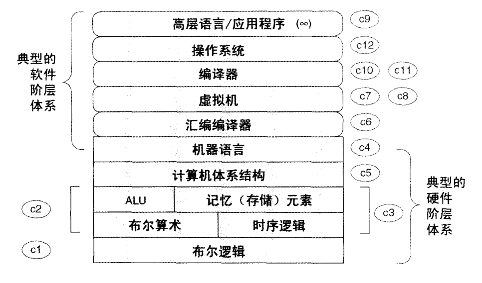
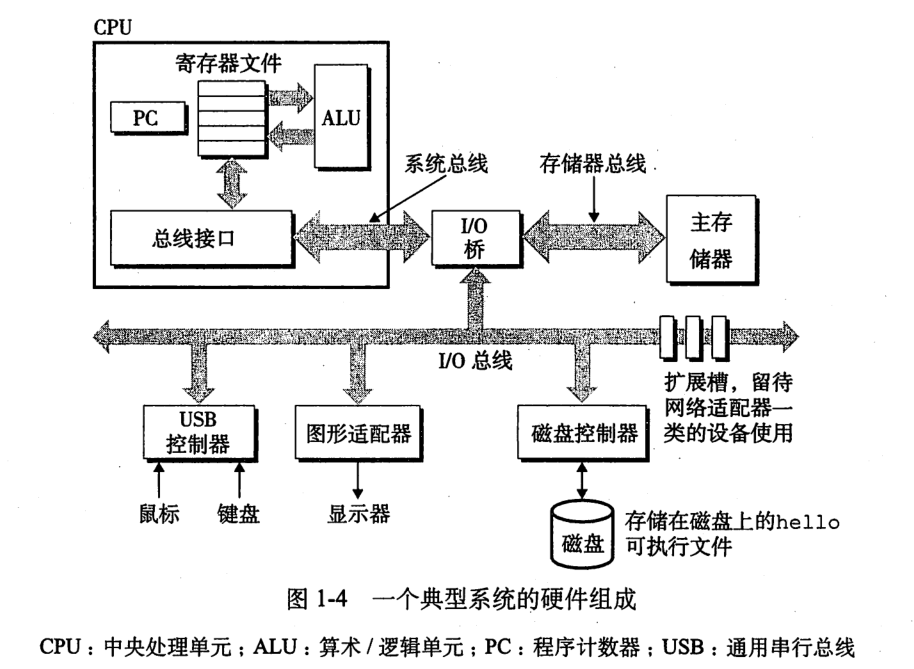

<!-- TOC -->

- [硬件](#硬件)
    - [中央处理器](#中央处理器)
        - [运算器](#运算器)
        - [控制器](#控制器)
    - [存储器](#存储器)
        - [主存储器](#主存储器)
        - [辅助存储器](#辅助存储器)
    - [输入输出设备](#输入输出设备)
    - [总线](#总线)
        - [缓存一致性](#缓存一致性)
- [软件](#软件)
- [资源](#资源)

<!-- /TOC -->

# 硬件

逻辑门;  
布尔运算;  
multiplexor (多路复用器);  
触发器 (flip-flop);  
寄存器 (register);  
RAM 单元; 计数器;  
硬件描述语言 (HDL, Hardware Description Language);  
芯片的仿真及测试. 

计算机最关键的三个部分：CPU,内存,I/O控制芯片。

## 中央处理器

硬件系统的核心是中央处理器（Central Processing Unit，简称 CPU）。它主要由控制器、运算器等组成，并采用大规模集成电路工艺制成的芯片，又称微处理器芯片。程序是由指令构成的, 处理器是执行指令的硬件设备, 一个系统中可能有多个处理器.

### 运算器

运算器又称算术逻辑单元（Arithmetic Logic Unit 简称 ALU）。它是计算机对数据进行加工处理的部件，包括算术运算（加、减、乘、除等）和逻辑运算（与、或、非、异或、比较等）。

### 控制器

控制器负责从存储器中取出指令，并对指令进行译码；根据指令的要求，按时间的先后顺序，负责向其它各部件发出控制信号，保证各部件协调一致地工作，一步一步地完成各种操作。控制器主要由指令寄存器、译码器、程序计数器、操作控制器等组成。

## 存储器

存储器是计算机记忆或暂存数据的部件。计算机中的全部信息，包括原始的输入数据。经过初步加工的中间数据以及最后处理完成的有用信息都存放在存储器中。而且，指挥计算机运行的各种程序，即规定对输入数据如何进行加工处理的一系列指令也都存放在存储器中。存储器分为内存储器（内存）和外存储器（外存）两种。

### 主存储器

也称内存, 直接与 CPU 相连, 是计算机的工作存储器, 计算机当前正在运行的程序与数据必须存放在主存内. 存取速度快, 但存储量小.

### 辅助存储器

也称外存, 存储容量大, 几乎存放计算机的所有信息, 在计算机实际执行程序和加式处理数据时, 辅助存储器中的信息需要先传入内存后才能被 CPU 使用.

## 输入输出设备

简称 I/O 设备, 是计算机与外界联系的桥梁, 输入设备是指能向计算机系统输入信息的设备, 输出设备是指能从计算机系统输出信息的设备.

## 总线

是连接计算机 CPU、内存、辅存、各种输入输出部件的一组物理信号线及其相关的控制电路, 是计算机中用于在各部件间运载信息的公共机构.

### 缓存一致性

1. 通过在总线加 `LOCK#` 锁的方式.
2. 通过缓存一致性协议(Cache Coherence Protocol), 如 MESI

在早期的 CPU 当中，是通过在总线上加 `LOCK#` 锁的形式来解决缓存不一致的问题。因为 CPU 和其他部件进行通信都是通过总线来进行的，如果对总线加 `LOCK#` 锁的话，也就是说阻塞了其他 CPU 对其他部件访问（如内存），从而使得只能有一个 CPU 能使用这个变量的内存。在总线上发出了 `LCOK#` 锁的信号，那么只有等待这段代码完全执行完毕之后，其他 CPU 才能从其内存读取变量，然后进行相应的操作。这样就解决了缓存不一致的问题。

但是由于在锁住总线期间，其他 CPU 无法访问内存，会导致效率低下。因此出现了第二种解决方案，通过缓存一致性协议来解决缓存一致性问题。

# 软件

[操作系统面试题](https://mp.weixin.qq.com/s/sTGsnLf0UhzeMoKHSEJI9g) 

# 资源

[程序员的自我修养：温故而知新](https://mp.weixin.qq.com/s/8rQKJxFaFDznrTRHmVNNQA) 
[来点硬核的：什么是RDMA？](https://mp.weixin.qq.com/s/b6NaCu0_M-__XHWpKODx6w) 
[【底层原理】基本内存管理（上）](https://mp.weixin.qq.com/s/MGEMmrCxTfi8K8spebsC_w) 
[【底层原理】网络数据传输时经历了哪些buffer](https://mp.weixin.qq.com/s/ZaQ6rpT_jOyaEtW7YPNXZw) 
[【系统编程】高性能网络I/O入门（一）](https://mp.weixin.qq.com/s/IUlwCPvf8okbHsbfd1q2rA) 
[【系统编程】五种IO模型分析](https://mp.weixin.qq.com/s/9YXsJo_u2zVNqvABoGqfqg) 
